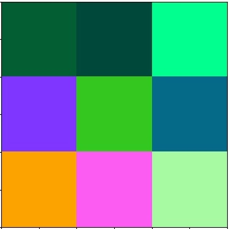

# DeepManeuver: Adversarial Test Generation for Trajectory Manipulation of Autonomous Vehicles

Paper authors: Meriel von Stein, David Shriver, Sebastian Elbaum

Corresponding author: Meriel von Stein

This repo contains the tools, paper, and study data for "DeepManeuver: Adversarial Test Generation for Trajectory Manipulation of Autonomous Vehicles".
DOI 10.1109/TSE.2023.3301443.

We argue that for adversarial testing perturbations to be effective on autonomous vehicles, they must account for the subtle interplay between the DNN and vehicle states.
Building on that insight, we develop DeepManeuver, an automated framework that interleaves adversarial test generation with vehicle trajectory physics simulation. 
Thus, as the vehicle moves along a trajectory, DeepManeuver enables the refinement of candidate perturbations to: 
(1) account for changes in the state of the vehicle that may affect how the perturbation is perceived by the system; 
(2) retain the effect of the perturbation on previous states so that the current state is still reachable and past trajectory is preserved; and
(3) result in multi-target maneuvers that require fulfillment of vehicle state sequences (e.g. reaching locations in a road to navigate a tight turn).

**Example trajectory of DeepManeuver versus state-of-the-art techniques**


**Example output billboards by resolution**

| 3x3 resolution                                | 5x5 resolution                                | 20x20 resolution                                  |
|-----------------------------------------------|-----------------------------------------------|---------------------------------------------------|
|  |  |  |

[//]: # (## Running the Demo)

**Repository structure:**
```python
./
├───data # paper study data
├───docs # documentation and figures
│   └───figures
├───paper # paper and appendix
├───study # scripts to reproduce paper study results
└───tools
    ├───models # steering DNNs
    ├───perturbation_generator # DeepManeuver and DeepBillboard
    └───simulation # run DeepManeuver in simulation
        ├───dataset-collection # scripts to collect data for model training
        ├───posefiles # environment configuration files
        ├───results # perturbation run results and metadata
        └───system-tests # test simulation setup
```

## Study Data
Directions to download the data from the paper can be found in the `data` directory.

Scripts to recreate the tables and figures can be found in the `analysis` directory.


## Installation

DeepManeuver relies on Python 3.8, BeamNGpy, and the BeamNG driving simulator.

Download Python 3.8 [here](https://www.python.org/downloads/release/python-380/).
Download CUDA Toolkit 11.6 [here](https://developer.nvidia.com/cuda-11-6-0-download-archive)

Activate a virtual environment and install the dependencies for this project by running `install.sh or running the following`:
```bash
python3.8 -m venv .venv-dm
. .venv-dm/bin/activate
pip install --upgrade pip
pip install requirements.txt
```

Install torch with cuda enabled [here](https://pytorch.org/get-started/locally/).
Backup options if the linked instructions do not work:
```
pip3 install torch torchvision torchaudio --extra-index-url https://download.pytorch.org/whl/cu116
pip install torch torchvision torchaudio --pre --extra-index-url https://download.pytorch.org/whl/nightly/cu116 # nightly build
```

Request a research license from BeamNG [here](https://support.beamng.com/) and install BeamNG.research.v1.7.0.1.
They're based in Germany so there is a time difference.
You can also email [research@beamng.gmbh](mailto:research@beamng.gmbh).

You may need to install [Visual Studio 2015, 2019 and 2019 redistributable](https://support.microsoft.com/en-nz/help/2977003/the-latest-supported-visual-c-downloads) to run on Windows 10.
See [Matplotlib issue #18292](https://github.com/matplotlib/matplotlib/issues/18292/).


## Run DeepManeuver and output performance metrics

```bash
python collect-perturbed-trace-metas-demo1.py <path-to-external-dependencies> <road-id>
```

The `<path-to-external-dependencies>` parameter points to the parent directory that contains your BeamNG installation and DeepManeuver repo.

The `<road-id>` value is either `7983` or `7982` depending on your BeamNG installation.


# License
The software contained in this repository is covered under the included [LICENSE](LICENSE) file. 
The paper included in this repository is not covered by this license and is instead covered by the [IEEE Copyright](https://ieeexplore.ieee.org/document/10213222). 
The paper is included under the terms of the IEEE copyright to be included on the author's personal servers.
